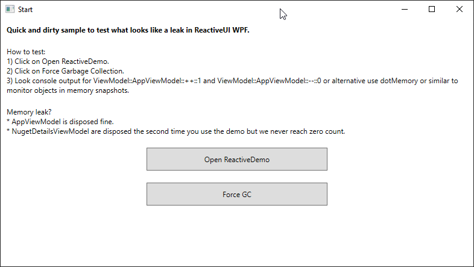

# ReactiveUI WPF Getting Started Demo MemoryLeak
Testing a memory leak in ReactiveUI WPF Getting Started Sample

# Solution
I finally found the solution. It was the WPF collection binding leak -> https://www.jetbrains.com/help/dotmemory/2020.1/Inspections.html#wpf_collection_binding_leak

Changing IEnumerable<NugetDetailsViewModel> to ObservableCollection<NugetDetailsViewModel> fix it!